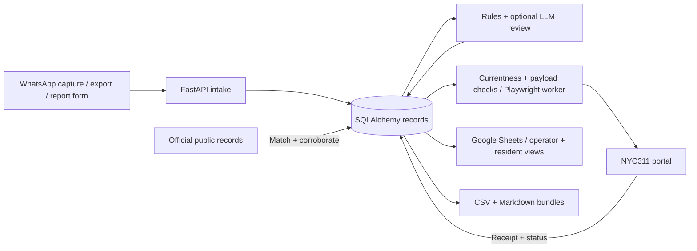

# Tenant Issue OS

Tenant reports arrive as chat messages, while incident history, evidence, and city service requests live in different places. Tenant Issue OS connects those records so an operator can trace a reported problem from the original message through follow-up and case status.

This Python/FastAPI project combines WhatsApp capture, incident tracking, NYC311 integration, public-record checks, and Google Sheets reporting. It was developed for a single-building tenant workflow, with traceable decisions and separate operator and resident views.

**Start here:** [public tenant spreadsheet](https://docs.google.com/spreadsheets/d/1zdbS-MXdHzUu_dOoyOxD1gUGGyqkcKB2_DIFhy5MqP0/edit#gid=0) · [how to read the spreadsheet](docs/PUBLIC_SPREADSHEET.md) · [local setup](#local-setup) · [verification](docs/VERIFY.md) · [operator guide](docs/OPERATIONS.md) · [API reference](docs/API_REFERENCE.md)

## What it does

- Captures messages and attachments through Chrome/Playwright, imports WhatsApp TXT/ZIP exports, and accepts an optional tenant report form.
- Deduplicates reports, combines rules with optional LLM review, and records the classification evidence and final decision.
- Groups reports into incidents, tracks outage/restoration events and witnesses, and links NYC311 service requests.
- Queues eligible current incidents for a Playwright filing worker, rechecks the exact payload before submission, and retains uncertain submissions for reconciliation.
- Checks official public records and keeps management claims, tenant observations, and corroborated records distinct in the replacement-project watchdog.
- Generates operator spreadsheets, a separate resident `Tenant Log`, and CSV/Markdown chronology bundles.

## Architecture



The database holds messages, decisions, incidents, filing jobs, and case records. Sheets are generated views; editing a cell is not a database update or a filing approval. Local development can use SQLite and inline processing. The deployment configuration supports PostgreSQL and a Redis/RQ processing path; see the [worker compatibility note](docs/OPERATIONS.md#docker-and-background-processing).

## Human control and safety boundaries

- **Live filing is automatic when enabled.** The supplied `.env.example` sets `AUTO_FILE_ENABLED=1`. Normal eligible jobs do **not** require per-case approval; `/approve` remains for legacy/manual compatibility. Operators choose sources, building configuration, eligibility thresholds, credentials, and whether to run the worker. For local review, disable filing and leave the portal worker and automation daemon stopped.
- **Before the final click**, the worker rechecks incident eligibility and the claim-bound payload. It records `submitting` before clicking; `submission_unknown` and `submitting` do not automatically retry. An operator must reconcile the receipt before considering another attempt. [Filing contract →](docs/NYC311_PORTAL_AUTOMATION.md)
- **Historical processing suppresses filing creation.** Archive-processing and reprocessing paths suppress new filing jobs; weekly audit and cloud recovery runners disable automatic filing for their historical processing. Keep filing disabled and workers stopped during review/import. Later queue operations can still act on eligible incidents, and an age threshold alone is not a replay safeguard.
- **LLM output is recorded evidence, not filing authority.** Rules, model output, and the final decision are retained. Required model-review failures remain visible; a supervised audit does not treat a missing review as a successful non-issue.
- **Sharing is an operator decision.** Use a dedicated resident workbook, because sharing applies to the whole Google workbook. Redaction rules are not a privacy guarantee: inspect rendered text and linked media before sharing. Some media routes are public by design. Keep raw exports, credentials, access-needs records, and operator tabs private. [Sharing boundaries →](docs/OPERATIONS.md#resident-sharing-and-private-data)

## Local setup

Use a fresh checkout with Python 3.11 (the repository pins 3.11.15). This path needs no Google, WhatsApp, NYC311, or OpenAI credentials.

```bash
git clone https://github.com/MuckseamPonoma-Renco/455_tenants.git
cd 455_tenants
python3.11 -m venv .venv
.venv/bin/python -m pip install -r requirements.txt

export DATABASE_URL=sqlite:///./local-review.sqlite3
export PROCESS_INLINE=1
export DISABLE_SHEETS_SYNC=1
export LLM_MODE=off
export AUTO_FILE_ENABLED=0
export INGEST_TOKEN=local-review-only
export MOBILE_FILER_TOKEN=local-review-only

.venv/bin/python -c "from packages.db import init_db; init_db()"
.venv/bin/python -m uvicorn apps.api.main:app --host 127.0.0.1 --port 8000
```

Open `http://127.0.0.1:8000/docs` for the API schema. The example tokens are only for this loopback review session. Use fictional inputs and do not call live status/public-record sync endpoints during offline review. On a machine with an existing deployment, isolate status-file paths as described in [verification](docs/VERIFY.md#isolated-smoke-check).

The exports apply to the current shell. Bare `uvicorn` does not load `.env` automatically. Production-oriented scripts have their own environment loading; [configure integrations separately](docs/OPERATIONS.md#integration-configuration) after local verification. Copying `.env.example` without reviewing it is not a safe local quick start.

## Verification

From the fresh checkout:

```bash
.venv/bin/python -m pytest -q
node --test cloudflare/chat_export_receiver/worker.test.mjs
```

The Python suite uses a disposable SQLite database and disables Sheets and LLM calls in its fixtures. The receiver tests require a recent Node.js runtime with `node:test` and Web APIs. Tests exercise application behavior with fixtures and mocks; they do not establish live capture, successful city submissions, current public records, or spreadsheet freshness.

See [verification](docs/VERIFY.md) for an isolated smoke check and the separate checks needed for a configured deployment. Live complaints are operational actions, not demo tests.

## Explore the implementation

| Area | Source |
| --- | --- |
| Intake and authenticated API routes | [`apps/api/routers/`](apps/api/routers/) |
| Incident and decision processing | [`packages/incident/`](packages/incident/), [`packages/worker_jobs.py`](packages/worker_jobs.py) |
| Filing eligibility, payload validation, receipts | [`packages/nyc311/`](packages/nyc311/) |
| Public-record checks and project watchdog | [`packages/public_records/`](packages/public_records/), [`packages/project_watch/`](packages/project_watch/) |
| Operator and resident output | [`packages/sheets/`](packages/sheets/) |
| Regression tests | [`tests/`](tests/), [uncertain-submission tests](tests/test_311_uncertain_callbacks.py) |

The [operator guide](docs/OPERATIONS.md) retains configuration, LLM modes, the endpoint inventory, rollout steps, and links to current and legacy setup guides. Browser sessions, upstream portals, API access, and source freshness remain deployment dependencies; a passing local suite is not an uptime claim.
