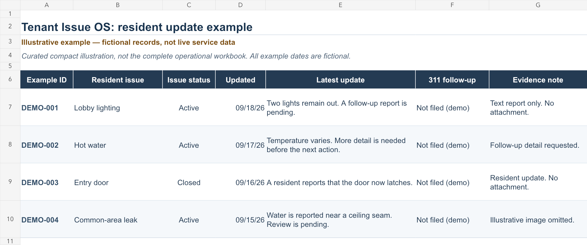

# Resident update example

**Illustrative example — fictional records, not live service data.**

This compact example shows how a resident can read an issue, its latest update, its status and the available evidence. It is a curated illustration, not an export or exact reproduction of the complete operational workbook. All records, identifiers, dates and descriptions are fictional. No 311 cases were filed for this example.

[Download the single-sheet workbook](assets/tenant-updates-example.xlsx)

The public renderer in [`packages/sheets/sync.py`](https://github.com/MuckseamPonoma-Renco/455_tenants/blob/main/packages/sheets/sync.py) supplies the underlying presentation concepts: updated date, issue, summary, 311 follow-up and evidence. Its incident-status helper supplies Active/Closed labels. The DEMO IDs identify example rows only. The compact example combines selected concepts from the public update log and status helpers; the full public view also includes category summaries and a separate 311 case watch.

The example contains no real resident messages, names, units, building identifiers, service-request numbers, contact details or evidence links. Nothing in this workbook files a request, sends a message or updates a service. It demonstrates information presentation only.
